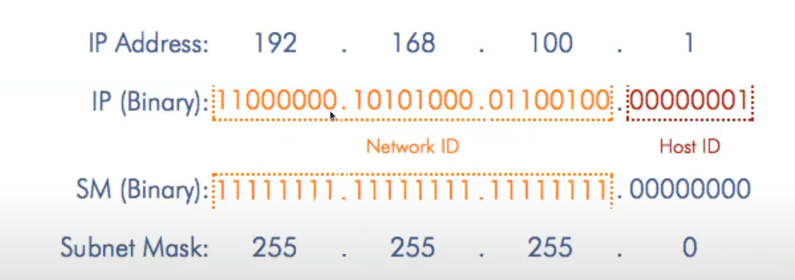

# 3. Networking - VPC

# Table of Contents

0. [Nội dung & mục tiêu](#nội-dung--mục-tiêu)
1. [Network căn bản](#1-network-căn-bản)
2. [VPC & Subnet Overview](#2-vpc--subnet-overview)

## Nội dung & mục tiêu

### Nội dung bài học
+ 1. Network căn bản
+ 2. VPC & Subnet Overview
+ 3. VPC connection
+ 4. VPC traffic management
+ 5. VPC Pricing

### Mục tiêu
- [] Kiến thức cơ bản network 
- [] Nắm được mô hình các dịch vụ network trên AWS (VPC)
- [] phác thảo kiến trúc AWS VPC
- [] Tự thiết kế & từng bước triển khai VPC hoàn chỉnh
- [] Triển khai tài nguyên nằm trong VPC
- [] Vai trò của Security Group & Access Control List

## 1. Network căn bản

### Network
+ 1 network gồm > 2 thiết bị đc kết nối *nhằm chia sẻ tài nguyên*
    + có thể chia nhỏ thành các subnet
    + cần có thiết bị mạng (router/switch) để cung cấp kết nối giữa các thiết bị

*=> cần biết vị trí của nhau.*

### Địa chỉ ip
+ mỗi client <-> 1 địa chỉ ip duy nhất | kết nối
+ thể hiện dưới dạng thập phân
+ Ipv4 (32 bit), ipv6 (128 bit)

*=> quy hoạch các địa chỉ IP*

## Classless inter domain routing (CIDR)
+ Các phương pháp quy hoạch:
    - **Classful**: 
        - ver1: Phân chia *ip address* theo classes A, B, C
            
            
            - *hạn chế*: dải địa chỉ bị quy hoạch sẵn => không đáp ứng khi số lượng tăng lên nhiều          
        - ver2: Cố định địa chỉ IP (thông qua số bits) khác nhau theo các loại:
            

            - *hạn chế*: có thể xảy ra dư thừa đia chỉ ip cấp phát. Vd: chọn loại C ~> có thể cấp phát 2^8 = 256 IPs. Trong khi nhu cầu chỉ cần cấp phát 15 IPs.         
        

    - **Classless**:
        - sử dụng thêm subnet mark + config ip => prefix
        - subnet mark: đánh dấu các bit không đổi của các địa chỉ trong cùng subnet.
            

        - vd: 
            

        - Từ ipv4 & subnetmark -> subnet id:
            
        
        - Default gateway: 

        - Tool: solarwinds.com/free-tools/advanced-subnet-calculator

## 2. VPC & Subnet Overview

### Khái niệm
+ Cung cấp **logical network** độc lập trên aws cloud, tạo m.trường kết nối mạng cho các máy chủ
    - logical network: sẵn sàng để sử dụng luôn
+ có khả năng quản lý tài nguyên:
    - thiết lập dải địa chỉ ip
    - tạo các subnet
    - cấu hình ác quy tác định tuyến & gateway
+ cho phép người quản trị có thể tùy chính các cài đặt về network
+ cung cấp nhiều lớp bảo mật

+ Note: software defined networking

### VPC & subnet
+ Cấu trúc AWS Cloud
    

        - AZ: Availability Zones

+ VPC: 
    - mỗi vpc đọc lập về mặt logic
    - nằm trên 1 region
    - thuộc về 1 *account id* duy nhất

+ Subnet:
    - mỗi subnet thuộc 1 vpc
    - dải ip của subnet thuộc dải của vpc
    - subnet nằm trên 1 az
    - 2 loại:
        - public: ip v4 cho phép truy cập từ bên ngoài
        - private: nội bộ trong vpc

### Cấu hình địa chỉ IP
+ vpc cần setup dải địa chỉ ip khi khởi tạo & k thể thay đổi
+ Subnet trên cùng vpc phải được cấu hình dải đ.chỉ IP độc lập, không được overlap
+ Giới hạn dải IP trong VPC:
    - /16: ~ 655365 IPs
    - /28: ~ 16 IPs

### Route table
+ Bảng lưu danh sách các quy tắc định tuyến traffic đi từ subnet
    + mỗi quy tắc: {Destination - Target}
        - Destination: dải địa chỉ mà traffic muốn đến
        - Target: trỏ tới gateway
    + default, cac subnet cùng nằm trong một VPC có thể kết nôi tới nhau dựa trên local route
    + mỗi subnet chỉ được gắn với 1 route table
    + nếu k đc gắn với route table, subnet sẽ tự động gán với *main route table*

    + *main route table*:
        

### Elastic network interface
+ ~ *Virtual Network Interface* được sử dụng như card mạng cho instance
+ Có thể detach ENI khỏi instance & attach ENI đó sang instance khác

### Internet Gateway
+ cho phép tài nguyên bên trong nếu có 2 thành phần **public IP** & **route table** có thể đi ra ngoài internet thông quan I.G

    

### Lab3.1_VPC_PublicSubnet

+ Buoc 1: tao VPC
+ Buoc 2: tao 2 subnet o 2 *Availability Zones* khac nhau
    + Buoc 2.1: de 2 subnets truy cap ra ngoai:
        - enable: tu dong gan IPv4 public. *Process*:
            - Action -> Edit subnet setting -> Enable auto assign public IPv4 address.
    + Buoc 2.2: Cau hinh cho 2 subnets de truy cap ra ngoai qua Internet Gateway       
        - Buoc 2.2.1: Tao internet gateway
        - Buoc 2.2.2: Gan I.G vao VPC
+ Buoc 3: Cau hinh Table Route 
    + Buoc 3.1: Tao Table route
    + Buoc 3.2: Cau hinh subnet duoc su dung cho Route Table nay
        + Subnet associations -> Edit subnet associations -> Save associations
    + Buoc 3.3: Cau hinh route
        + Routes -> Edit routes -> 
+ Buoc 4: Check by EC2
    + Network settings
        + select vpc
        + security group (~ visual firewall): **!cấu hình firewall**
    + Luu lai: 
        + Public IPv4: 13.229.80.189 (thay doi)    
        + Private IPv4: 10.0.2.243
        + Khi disconnect -> mat public ip ~> khi mo lai, Public IPv4 thay doi
    + Để giải quyết vấn đề thay đổi IP khi restart, AWS cung cấp *Elastic IP address*. 
        + *Elastic IPs*  -> Allocate Elastic IP address -> Allocated
        + **Elastic IP này chúng ta sẽ thuê của AWS ~> tính phí**. Attack vào 1 instance => start/stop instance k thay đổi IP address:
            + Chọn Elastic IP -> Actions -> Associate Elastic IP address (để gán vào 1 instance cụ thể)
            + **Note**: 
                - đã khởi tạo 1 Elastic IP là tốn tiền
                - *Disasociate Elastic IP address*

+ Note:
    - địa chỉ VPC IP not exist public -> sử dụng dải ip private. check: https://www.iana.org/assignments/iana-ipv4-special-registry/iana-ipv4-special-registry.xhtml

    - IPv4 CIDR

### NAT Gateway (Network Address Translation)
- Đặt vấn đề
    - Xét các trường hợp k cần kết nối với bên ngoài => **private subnet**
- Đặc trưng *Private Subnet*
    - gán các private ip cho các tài nguyên bên trong
    - route table sẽ đi qua *NAT Gateway* thay cho *Internet Gateway*
        - NAT Gateway check *public subnet route table* 
    - NAT Gateway nằm trong public subnet.
        - Nếu nằm trong private subnet ~> loop issue
        - NAT Gateway check *private subnet route table* 
- Vai trò: mapping địa chỉ ip với port & public ip để đi ra ngoài
    - priviate ip ~> NAT ~> public ip
    - định nghĩa mappping bởi mapping table
    

+ Practice:
    - tao private NAT gateway
    - associate with  2 private subnets
    - edit route: thay vi gan Internet gateway bang nat gateway

+ **Note**: 
    - llưu ý: **tránh** việc config instance có private ip với Internet Gateway.
+ Config chiều ngược lại từ internet truy ngược đến private ip 

### Bastion Host
+ Truy cập instance trong private, ta truy cập thông qua Bastion Host (~ đóng vai trò như cầu nối giữa user vs private server)
    

### Lab 3.2 VPC voi Private Subnet 

    

    + Tao subnets
    + Tao NAT Gateway & cau hinh route
        - **tim hieu** nat gateway co the scale
    + *NAT instance*:  

### Lab 3.3 Tao bastion host 
+ Tao EC2 

## 3. VPC connection 

## VPC Peering: 
+ Tạo kết nối giữa 2 vpc bất kể không nằm trên cùng một AWS account or region

+ Lưu ý khi tạo vpc peering:
    - dia chi ip cua 2 vpc k duoc overlap
    - khong ho tro bac cau
    - giua 2 vpc chi co the tao 1 ket noi peering.

    - Visualization: 
    !(aws vpc peering)[https://www.google.com/imgres?imgurl=https%3A%2F%2Fi.stack.imgur.com%2FE0mK0.png&imgrefurl=https%3A%2F%2Fstackoverflow.com%2Fquestions%2F47858052%2Faws-vpc-peering&tbnid=_NmFZaytoAN0EM&vet=12ahUKEwjwiIuYlK35AhXC_zgGHWcoDJMQMygFegUIARC7AQ..i&docid=lDFqlnfwJ8ivnM&w=545&h=448&q=vpc%20peering&ved=2ahUKEwjwiIuYlK35AhXC_zgGHWcoDJMQMygFegUIARC7AQ]

### Lab 4: Tao vpc peering    

## 4. VPC traffic management

## 5. VPC pricing

