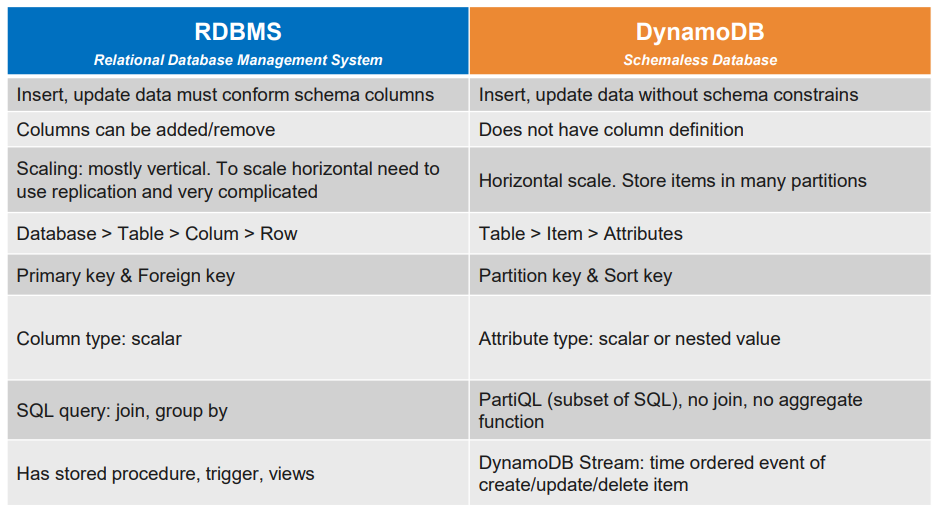

# DynamoDB

## NoSQL Introduction

+ NoSQL: Nonrelational databases with flexible data models. Một vài dạng NoSQL databases:
    - key - value, eg: amazon dynamodb
    - document
    - in-memory
    - graph

## DynamoDB Basic

+ fully managed NoSQL 
+ High availability with replication across multiple AZs:  
    - duoc phan bo cho nhieu AZs
+ Horizontal, auto scale to massive work load
+ Store data in several partitions
+ Low latency on write & read operation 
+ Integrated with IAM    

+ Compare 

+ 

## Lab 01. CRUD in DynamoDB

## DynamoDB Read Write Capacity

## Lab 02. Access DynamoDB with CLI

## Lab 03. PartiQL
